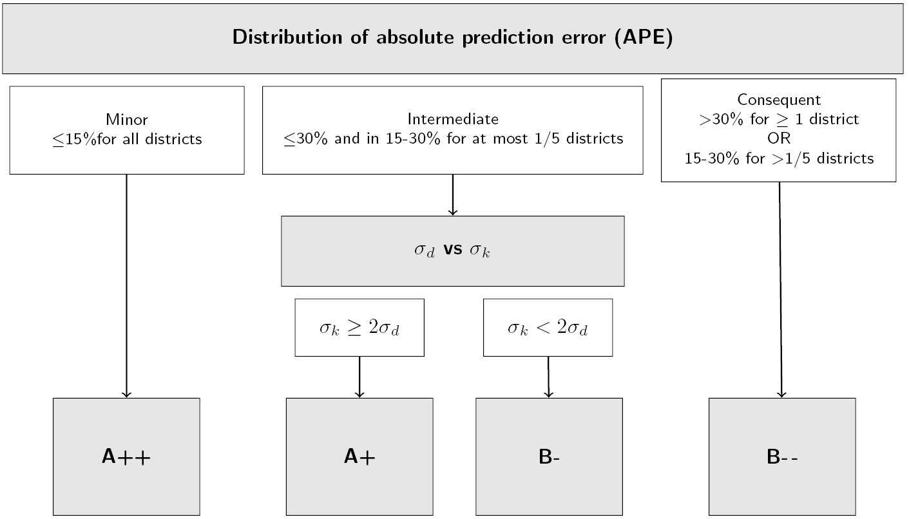

```{r,eval=T,echo=F}

options(dplyr.print_min = 5)
options(dplyr.print_max = 5)
knitr::opts_chunk$set(echo=T, fig.align="center",cache=T)

## set.seed(10)
## dt_calib<-dt_calib%>%
##   group_by(site,dist,age)%>%
##   mutate(N_I=rpois(lambda=N_I,n=1))%>%
##   rowwise()%>%
##   mutate(N_HC=rpois(lambda=N_HC,n=1))

``` 


# Overview#

This document illustrates the application of the three-stage
methodology using national non-registry data to predict cancer
incidence (CI) in geographical areas without an cancer registry. The
method and the R code used is illustrated for two cancer sites: pancreatic cancer
in men and melanoma in women over the 2007-2015 period.
This document details the different steps of calibration, validation and
post-processing of the data. 
Its organisation follows the method section of the article.


R-package
---------

The material and R code used in this application are part of the 
R-package `CalibInc`, available in Github. 
Use [devtools](https://github.com/hadley/devtools) to install the package: 

```{r,echo=T,eval=F}
require(devtools)
install_github("echatignoux/CalibInc")
```

After installation, the package can be loaded into R.

```{r,echo=T}
library(CalibInc)
```

The `tidyverse`, `mgcv`, `spdep` and `INLA` packages are also needed to run the
following code.


```{r,echo=T}
library(tidyverse)
library(mgcv)
library(spdep)
library(INLA)

``` 

Data sources
---------

The application of the method is illustrated here for two cancer
sites, pancreatic cancer in men and melanoma in women, for the
2007-2015 period.

To evaluate the calibration model, incidence and HC data for
districts covered by a cancer registry are needed. They are provided
in the table `dt_calib`.

To predict incidence in all districts, we need  HC data for all the
French districts. These data are in the table `dt_pred`.

Note that, in order to comply with diffusion constrains,
the numbers of cancer and HC cases in the datasets were slightly
altered.

# Calibration step#

## Overview of the data ##

The data set used for calibration and validation consists, in each district covered by a
cancer registry, in the number of cancer cases (`N_I`), the number of
patients retrieved in HC data (`N_HC`), aggregated by cancer cause (`site`),
district (`dist`), HC source (`SRC`) and 5 years age groups
(column `age` is the median of age group). Additional columns `py` and
`pop_WHO` respectively refer to the number of person-year and to the
standard WHO population of 1960.

The structure of the data is presented below:

```{r}
dt_calib%>%sample_n(5)

``` 

##  Evaluation of the calibration model ##


```{r,eval=F,echo=F}

age_fltr<-dt_calib%>%
  select(-SRC,-N_HC)%>%
  unique()%>%
  group_by(site,age)%>%
  summarise(N_I=sum(N_I))%>%
  group_by(site)%>%
  mutate(N_I=cumsum(N_I))%>%
  filter(N_I>5)%>%
  slice(1)%>%
  select(-N_I)%>%
  rename(age_fltr=age)


``` 


<!-- The calibration model (model 1 in the manuscript) requires the lo of -->
<!-- incident cancer cases to be introduced as an offset in the -->
<!-- model. Thus, rows with no incident cancer cases are not used to -->
<!-- evaluate the calibration model.  -->

###  Estimation ###

The calibration model (model 1 in the manuscript) is evaluated, for
each cancer site and health-care proxy, via the `gam` function from `mgcv`
package. 
The log of the number of incident cancer cases is introduced as an offset in the
model (thus, rows with no incident cancer cases are not used to
evaluate the calibration model). The age effect is introduced as a thin-plate spline
(`s(age,bs="tp")`), with one knot at distinct values of observed age
(`knots=nk`). The district effect is modelled as an intercept random
effect (`s(dist,bs="re")`).

The model formula is specified as below:

```{r,echo=T}
nk<-list(age=unique(dt_calib$age)) 
form<-N_HC~offset(log(N_I))+s(age,bs="tp")+s(dist,bs="re") 

``` 

And the models evaluated separately for each cancer site and proxy:


**_Pancreas - men_**


```{r,echo=T}
dt_panc<-dt_calib%>%filter(site=="Pancreas-men")%>%droplevels()
m_panc_A<-gam(form,family="quasipoisson",knots=nk,data=dt_panc%>%filter(SRC=="A",N_I>0),method="REML")
m_panc_H<-gam(form,family="quasipoisson",knots=nk,data=dt_panc%>%filter(SRC=="H",N_I>0),method="REML")
m_panc_HA<-gam(form,family="quasipoisson",knots=nk,data=dt_panc%>%filter(SRC=="HA",N_I>0),method="REML")
m_panc_M<-gam(form,family="quasipoisson",knots=nk,data=dt_panc%>%filter(SRC=="M",N_I>0),method="REML")

```

**_Melanoma - women_**

```{r,echo=T}
dt_mela<-dt_calib%>%filter(site=="Melanoma-women")%>%droplevels()
m_mela_A<-gam(form,family="quasipoisson",knots=nk,data=dt_mela%>%filter(SRC=="A",N_I>0),method="REML")
m_mela_H<-gam(form,family="quasipoisson",knots=nk,data=dt_mela%>%filter(SRC=="H",N_I>0),method="REML")
m_mela_HA<-gam(form,family="quasipoisson",knots=nk,data=dt_mela%>%filter(SRC=="HA",N_I>0),method="REML")
m_mela_M<-gam(form,family="quasipoisson",knots=nk,data=dt_mela%>%filter(SRC=="M",N_I>0),method="REML")

```

###  Model checking ###

The quality of fit of the models can be visualized via the `gam.check`
function. For the melanoma model with A proxy for example, no
influential observation nor violation of model assumptions is apparent. 

```{r,echo=T,eval=F}
gam.check(m_mela_A)
``` 
```{r,echo=F}
quiet <- function(x) { 
  sink(tempfile()) 
  on.exit(sink()) 
  invisible(force(x)) 
} 

quiet(gam.check(m_mela_A))

``` 

Similar results apply to the other models.


###  HC/I ratios ###

The shape of the ratios may be visualized with the `plot.gam`
function, or obtained as predictions with `predict.gam`.

Using `predict.gam`, we may superimpose modelled mean HC/I ratio (red curve) with
the ratio observed in districts covered by registries (grey points and
lines): 

<details>
  <summary>Code for graphs of HC/I ratios - pancreas, men</summary>
```{r,eval=F}
## Predictions with N_I=1 (i.e. mean ratio) for each proxy
dt_rat<-tibble(age=unique(dt_calib$age),N_I=1,dist="d_1")
dt_rat$rat_A<-predict(m_panc_A,exclude="s(dist)",newdata=dt_rat,type="response")
dt_rat$rat_H<-predict(m_panc_H,exclude="s(dist)",newdata=dt_rat,type="response")
dt_rat$rat_HA<-predict(m_panc_HA,exclude="s(dist)",newdata=dt_rat,type="response")
dt_rat$rat_M<-predict(m_panc_M,exclude="s(dist)",newdata=dt_rat,type="response")

## Convertign to raw data
dt_rat<-dt_rat%>%
  gather(SRC,rat,rat_A:rat_M)%>%
  mutate(SRC=gsub("rat_","",SRC))

## Graph
dt_panc%>%
  ggplot(data=.)+
  geom_jitter(aes(age,N_HC/N_I,group=dist,size=N_I),alpha=0.2,height = 0,width = 0.5)+
  geom_line(aes(age,N_HC/N_I,group=dist),alpha=0.2)+
  geom_line(data=dt_rat,aes(age,rat),colour="red",size=1)+
  coord_cartesian(ylim=c(0,2),xlim=c(20,90))+
  facet_wrap(~SRC)+
  ylab("HC/I")+xlab("Age")+
  theme(legend.position = "bottom")+labs(size="# I")


``` 
</details>

```{r ratpanc,echo=T,fig.height=7,fig.cap="HC/I ratio by age - pancreas, men",echo=F}
## Predictions with N_I=1 (i.e. mean ratio) for each proxy
dt_rat<-tibble(age=unique(dt_calib$age),N_I=1,dist="d_1")
dt_rat$rat_A<-predict(m_panc_A,exclude="s(dist)",newdata=dt_rat,type="response")
dt_rat$rat_H<-predict(m_panc_H,exclude="s(dist)",newdata=dt_rat,type="response")
dt_rat$rat_HA<-predict(m_panc_HA,exclude="s(dist)",newdata=dt_rat,type="response")
dt_rat$rat_M<-predict(m_panc_M,exclude="s(dist)",newdata=dt_rat,type="response")

## Convertign to raw data
dt_rat<-dt_rat%>%
  gather(SRC,rat,rat_A:rat_M)%>%
  mutate(SRC=gsub("rat_","",SRC))

## Graph
dt_panc%>%
  ggplot(data=.)+
  geom_jitter(aes(age,N_HC/N_I,group=dist,size=N_I),alpha=0.2,height = 0,width = 0.5)+
  geom_line(aes(age,N_HC/N_I,group=dist),alpha=0.2)+
  geom_line(data=dt_rat,aes(age,rat),colour="red",size=1)+
  coord_cartesian(ylim=c(0,2),xlim=c(20,90))+
  facet_wrap(~SRC)+
  ylab("HC/I")+xlab("Age")+
  theme(legend.position = "bottom")+labs(size="# I")


``` 

```{r ratmela,fig.height=7,fig.cap="HC/I ratio by age - melanoma, women",echo=F}
## Predictions with N_I=1 (i.e. mean ratio) for each proxy
dt_rat<-tibble(age=unique(dt_calib$age),
               N_I=1,dist="d_1")
dt_rat$rat_A<-predict(m_mela_A,exclude="s(dist)",newdata=dt_rat,type="response")
dt_rat$rat_H<-predict(m_mela_H,exclude="s(dist)",newdata=dt_rat,type="response")
dt_rat$rat_HA<-predict(m_mela_HA,exclude="s(dist)",newdata=dt_rat,type="response")
dt_rat$rat_M<-predict(m_mela_M,exclude="s(dist)",newdata=dt_rat,type="response")

## Convertign to raw data
dt_rat<-dt_rat%>%
  gather(SRC,rat,rat_A:rat_M)%>%
  mutate(SRC=gsub("rat_","",SRC))

## Graph
dt_mela%>%
  ggplot(data=.)+
  geom_jitter(aes(age,N_HC/N_I,group=dist,size=N_I),alpha=0.2,height = 0,width = 0.5)+
  geom_line(aes(age,N_HC/N_I,group=dist),alpha=0.2)+
  geom_line(data=dt_rat,aes(age,rat),colour="red",size=1)+
  coord_cartesian(ylim=c(0,2),xlim=c(20,90))+
  facet_wrap(~SRC)+
  ylab("HC/I")+xlab("Age")+
  theme(legend.position = "bottom")+labs(size="# I")


``` 

The graphs first show that the heights and shapes of the HC/I ratios
by age vary between cancer sites and proxys. Second, the
spread of districts specific ratios around the mean ratio also varies
among proxys and cancer site. If we skip younger ages for which
ratios are highly variables due to small number of cases, district
ratios generally look more clustered around the mean ratio for 
pancreatic cancer in men than for melanoma in women.


The visual impression is confirmed by the values of the standard
deviation $\sigma_d$ of the district random effects, which are
obtained via the `gam.vcomp` function:

```{r,echo=T}
gam.vcomp(m_mela_A)

``` 

Applied to each model, it appears clearly that district deviations
from the mean calibration curves are much lower for pancreatic cancer
in men than  melanoma in women.

```{r tabsd,results='asis',echo=F}

library(kableExtra)
library(formattable)

mods=c(grep("m_mela",ls(),value=T),
    grep("m_panc",ls(),value=T))

mods_sd<-tibble(mod=mods)%>%
  mutate(sd=map_dbl(mod,function(m)
    quiet(gam.vcomp(get(m))[2,1])
    ))%>%
  separate(mod,c("a","site","SRC"))%>%
  select(-a)%>%
  mutate(sd=round(sd,2))%>%
  spread(SRC,sd)%>%
  mutate(site=factor(site,
                     levels=c("panc","mela"),
                     labels=c("Pancreas-men","Melanoma-women")))%>%
  arrange(site)%>%
  rename(`Cancer site`=site)

mods_sd%>%
  kable(caption="Between district-variability of the HC/I ratios",escape=FALSE,booktabs = TRUE) %>%
  kable_styling("hover", full_width = F)%>%
  add_header_above(c(" ", "$\\sigma_d$" = 4),escape = F)


``` 


#  Predictions in a district {#secpred}

For each model, the predictions are obtained with the `CalibInc`
function from `CalibInc` package. 

The code is illustrated below for prediction of melanoma
cancer incidence in women, using H proxy.

## Number of incident cases ##

For each district, the total number of cancer cases predicted with H
proxy (and associated standard errors) is obtained from the
calibration model `m_mela_H` and H data as follow: 

```{r,echo=T}
dt_mela_H<-dt_calib%>%filter(site=="Melanoma-women",SRC=="H")
dt_pred_mela_H<-CalibInc(mod=m_mela_H,pred=dt_mela_H,aggregate=~dist)
dt_pred_mela_H

``` 
The `aggregate` argument of the `CalibInc` function is used here to
specify the aggregation level of the predictions (the district
level here). 


Predictions intervals at 95% level may subsequently be added to the result table by
using the `LogNormPI` function from `CalibInc`.

```{r}
dt_pred_mela_H%>%LogNormPI()

``` 

Similarly, the predicted number of incident cases by age and districts
may be obtained by modifying the `aggregate` argument:

```{r}

CalibInc(mod=m_mela_H,pred=dt_mela_H,aggregate=~dist+age)%>%
  sample_n(5)%>%
  LogNormPI()

``` 


## Standardized incidence ##

Interest usually lies on standardised summary of the incidence in the
districts, such as standardized incidence rate or  standardized
incidence ratio. 

### Standardized incidence ratio {#subSIR}

The standardized incidence ratio in a district $j$ is calculated as
the ratio of the predicted ($\hat{I}_j=\sum_i \hat{I}_{ij}$) 
to the expected total number of cases in the district
$SIR_j=\frac{\hat{I}_j}{E_j}$. 

The expected number of cases is obtained by applying the age-incidence
rate in the reference population to the size of the district
populations, i.e. $E_j=\sum_i \frac{\hat{I}_{i.}}{py_{i.}}\times
py_{ij}$, where $\hat{I}_{i.}$ and $py_{i.}$ refer respectively to the total number
of predicted cancer cases and person-year of age $i$ in the reference population.


To obtain standardized incidence ratio, we need to calculate the
incidence rate by age in the reference population. If this population
is taken as the districts covered by a cancer registry for example, we can use the following
code to calculate SIR using the predicted incidence:

```{r,echo=T}

## 1- Calculate age incidence rate
## Total number of incident cases by age
dt_mela_H_rate<-CalibInc(mod=m_mela_H,pred=dt_mela_H,aggregate=~age)

## Add total number of py by age and calculate the rate
dt_mela_H_rate<-dt_mela_H_rate%>%
  left_join(
    dt_mela_H%>%
      group_by(age)%>%
      summarise(py=sum(py)))%>%
  mutate(rate=pred/py)

## 2- Calculate expected number of cases
dt_mela_H_E<-dt_mela_H%>%
  left_join(
    dt_mela_H_rate%>%select(age,rate)
  )%>%
  group_by(dist)%>%
  summarise(E=sum(py*rate))

## 3- Add expectd count to predicted counts and calculate the SIR
dt_SIR_mela_H<-dt_pred_mela_H%>%
  left_join(
    dt_mela_H_E)%>%
  mutate(SIR=pred/E)


``` 

### Standardized incidence rate ###

Standardized incidence rates $T_j$ are calculated in a given area $j$ as the sum
of incidence rate by multiplied by the person year of a standard
population $py^r_{i}$ : $\hat{T}_j=\sum_i
\frac{\hat{I}_{ij}}{py_{ij}}\times py^r_{i}=\sum_i \hat{I}_{ij}\times
\frac{py^r_{i}}{py_{ij}}$. 

The `CalibInc` function possess a `weight` argument that can be used
for this purpose. To calculate incidence rate standardized on the age
structure of the world's population in each districts covered by a cancer
registry one can use:

```{r,echo=T}
## Add weights to dt_mela_H table
dt_mela_H_T<-dt_mela_H%>%mutate(w=pop_WHO/py)
## Calculate standardized incidence rates in the districts using the weights
CalibInc(mod=m_mela_H,pred=dt_mela_H_T,weight=w,aggregate=~dist)

```


# Evaluation of the quality of the predictions and of their usefulness for epidemiology: districts with a cancer register

To evaluate the quality of the predictions, we estimate, in the
districts with registers, the gaps between predicted CI and observed
CI. This is done using a cross validation procedure as follows: for
each district $j$ with a register, predicted CI were obtained using the
HC/I ratio estimated by the model (1) evaluated after excluding
district $j$ and then prediction error (PE) between the total number of
predicted cases ($\hat{I}_{j}=\sum_i \hat{I}_{ij}$) and the total
number of observed incident cases ($I_{j}=\sum_i I_{ij}$) is computed:
$PE=\frac{\hat{I}_{j}-I_{j}}{I_{j}}$ 

The epidemiological usefulness of CI predictions is evaluated using
two principles. First, predictions with large errors (ie large PE, see
previous paragraph) observed in districts with a cancer registry may
be misleading and should be discarded. Second, predictions with errors
of moderate size may provide important information about the spatial
variation of the specific cancer site if the between-district
variation of CI is much larger than the errors (i.e., if the
"signal-to-noise" tradeoff remains favorable). 

This signal-to-noise ratio is assessed by comparing the
between-district variability of the HC/I ratio, which represents
"noise" or error, with the between-district variability of incidence,
which represents the epidemiological signal. Both are measured in
districts with a cancer registry. The former constitutes the standard
deviation $\sigma_d$ from the calibration model (1). Fitting a
Poisson mixed model to the observed CI rate, including age (penalized
regression spline) and district random effect, the latter is the
standard deviation $\sigma_k$ of this random effect. 

The above key quantities (PE and $\sigma_d$ vs $\sigma_k$) are then
placed in a decision tree, depicted in Figure 1, for each cancer site
and gender, to decide whether a given method (i.e. the use of a given proxy)
provides predictions of CI of adequate quality. When the absolute
value of PE (APE) is low for all the districts with a register (i.e.,
below 15%), predictions are considered valid with this method (method
rated A++). On the contrary, if at least one district has a high APE
(i.e., larger than 30%) or if more than 20% of districts have large
errors (between 15 and 30%), then the predictions are considered of
insufficient quality (method rated B--). For intermediate-sized
prediction errors (i.e., fewer than 20% of districts with an APE
between 15 and 30%), predictions may be considered informative if
geographical variations in CI rates are larger than the error (i.e.,
$\sigma_k>2\times \sigma_d$, which translates into a correlation between predicted and
true incidence of >0.9) (method rated A+). Methods rated A++ or A+ are
considered suitable to predict CI in all districts. 


## Predictions errors in cross-validation {#fp}

For each district in the registry area, the calibration model is
fitted without the district and the total number of incident cases
predicted in this district. For pancreas cancer in men, for
district "d_1" and proxy "A", we use the following code:

```{r,echo=T}

m_panc_cv_d1_A<-gam(form,family="quasipoisson",knots=nk,
       data=dt_panc%>%filter(SRC=="A",dist!="d_1",N_I>0),method="REML")
cv_d1_A<-CalibInc(m_panc_cv_d1_A,pred=dt_panc%>%filter(SRC=="A",dist=="d_1"),aggregate=~1)
cv_d1_A

```

The relative difference is then computed by comparing predictions to
observed number of cases:

```{r}
cv_d1_A%>%
  bind_cols(dt_panc%>%filter(SRC=="A",dist=="d_1")%>%summarise(N_I=sum(N_I)))%>%
  mutate(PE=100*(pred-N_I)/N_I)

``` 

The two steps are then repetaed for each district in the registry
 area.
 
<details>
  <summary>Code to compute complete cross-validation - pancreas, men</summary>
```{r}
cv_panc<-dt_panc%>%
  group_by(dist,SRC)%>%
  nest()%>%
  mutate(cv=pmap(list(dist,SRC,data),
                 function(d,src,dt){
    m<-gam(form,family="quasipoisson",knots=nk,
           data=dt_panc%>%filter(SRC==src,dist!=d,N_I>0),method="REML")
    CalibInc(m,pred=dt%>%mutate(dist=d),aggregate=~1)
                 }))%>%
  unnest(cv)%>%
  select(-N_HC)%>%
  unnest(data)%>%
  group_by(dist,SRC)%>%
  summarise(pred=mean(pred),se=mean(se),N_I=sum(N_I),N_HC=sum(N_HC))%>%
  mutate(PE=100*(pred-N_I)/N_I)

``` 
</details>

```{r,echo=F}

cv_mela<-dt_mela%>%
  group_by(dist,SRC)%>%
  nest()%>%
  mutate(cv=pmap(list(dist,SRC,data),
                 function(d,src,dt){
    m<-gam(form,family="quasipoisson",knots=nk,
           data=dt_mela%>%filter(SRC==src,dist!=d,N_I>0),method="REML")
    CalibInc(m,pred=dt%>%mutate(dist=d),aggregate=~1)
                 }))%>%
  unnest(cv)%>%
  select(-N_HC)%>%
  unnest(data)%>%
  group_by(dist,SRC)%>%
  summarise(pred=mean(pred),se=mean(se),N_I=sum(N_I),N_HC=sum(N_HC))%>%
  mutate(PE=100*(pred-N_I)/N_I)

``` 

The results are stored in tables `cv_panc` and `cv_mela` for pancreas
and melanoma cancers, respectively, printed below in tables
\@ref(tab:tabvalpanc) and \@ref(tab:tabvalmela).


For pancreas cancer in men, predictions errors are relatively small
for HA/I method (all below 10% in absolute value), whereas for the
other methods, errors are generally moderate, but consistent in some
districts (PE=17% for district d_2 with A/I method, 18% and -17% for
districts d_14 and d_15 with H/I, and 18% for district d_20 with M/I
method). 


```{r tabvalpanc,results='asis',echo=F}

val_panc<-cv_panc%>%
  select(-se)%>%
  arrange(SRC,dist)%>%
  mutate(PE=round(PE,1),
         pred=round(pred,1))%>%
  gather(var,val,N_HC,pred,PE)%>%
  mutate(val=as.character(val),
         var=factor(var,levels=unique(var)))%>%
  arrange(dist,SRC,var)%>%
  unite(var,SRC,var)%>%
  mutate(var=factor(var,levels=var))%>%
  spread(var,val)

tot_panc<-cv_panc%>%
  group_by(SRC)%>%
  mutate(PE=round(PE,1))%>%
  summarise(N_I=sum(N_I),
            N_HC=sum(N_HC),
            pred=round(sum(pred),1),
            PE=paste0(max(abs(PE)),"/",round(median(abs(PE)),1))
            )%>%
  gather(var,val,N_HC,pred,PE)%>%
  mutate(var=factor(var,levels=unique(var)))%>%
  arrange(SRC,var)%>%
  unite(var,SRC,var)%>%
  mutate(var=factor(var,levels=var))%>%
  spread(var,val)%>%
  mutate(dist="Total")

val_panc<-val_panc%>%
  bind_rows(tot_panc)
names(val_panc)[3:14]<-rep(c("N_HC","$\\hat{I}_j$","PE"),4)
val_panc%>%
  kable(caption="Detailed cross-validation in districts for pancreas, men",escape=FALSE,booktabs = TRUE) %>%
  kable_styling("hover", full_width = F)%>%
  add_header_above(c(" "=2, "A/I" = 3,"H/I" = 3,"HA/I" = 3,"M/I" = 3),escape = F)%>%
  row_spec(nrow(val_panc), bold = T)%>%
  footnote(general = "The total column gives the total number of observed and predicted cancer cases. In the PE column, maximum and median absolute prediction error is reported.",
           footnote_as_chunk = T, title_format = c("italic", "underline")
           )

``` 

For melanoma, predictions errors are much larger with each method,
with consistent errors in many districts (median absolute PE > 12%),
and very large errors in some districts (at least on district with
>30% absolute PE for each method).


```{r tabvalmela,results='asis',echo=F}

val_mela<-cv_mela%>%
  select(-se)%>%
  arrange(SRC,dist)%>%
  mutate(PE=round(PE,1),
         pred=round(pred,1))%>%
  gather(var,val,N_HC,pred,PE)%>%
  mutate(val=as.character(val),
         var=factor(var,levels=unique(var)))%>%
  arrange(dist,SRC,var)%>%
  unite(var,SRC,var)%>%
  mutate(var=factor(var,levels=var))%>%
  spread(var,val)

tot_mela<-cv_mela%>%
  group_by(SRC)%>%
  mutate(PE=round(PE,1))%>%
  summarise(N_I=sum(N_I),
            N_HC=sum(N_HC),
            pred=round(sum(pred),1),
            PE=paste0(max(abs(PE)),"/",round(median(abs(PE)),1))
            )%>%
  gather(var,val,N_HC,pred,PE)%>%
  mutate(var=factor(var,levels=unique(var)))%>%
  arrange(SRC,var)%>%
  unite(var,SRC,var)%>%
  mutate(var=factor(var,levels=var))%>%
  spread(var,val)%>%
  mutate(dist="Total")

val_mela<-val_mela%>%
  bind_rows(tot_mela)
names(val_mela)[3:14]<-rep(c("N_HC","$\\hat{I}_j$","PE"),4)
val_mela%>%
  kable(caption="Detailed cross-validation in districts for melanoma, women",escape=FALSE,booktabs = TRUE) %>%
  kable_styling("hover", full_width = F)%>%
  add_header_above(c(" "=2, "A/I" = 3,"H/I" = 3,"HA/I" = 3,"M/I" = 3),escape = F)%>%
  row_spec(nrow(val_mela), bold = T)%>%
  footnote(general = "The total column gives the total number of observed and predicted cancer cases. In the PE column, maximum and median absolute prediction error are reported.",
           footnote_as_chunk = T, title_format = c("italic", "underline")
           )

``` 


Predictions errors in cross-validation may advantageously be plotted
under the form of funnel plots,  which allows for a rapid
examination of the extend of the errors given their precision
[@Spiegelhalter2005b].  In these funnel plots, the precision of the
errors was defined as the inverse of its coefficient of variation, and
confidence limits at the 95% levels under the null hypothesis of zero
error are drawn.

<details>
  <summary>Code for funnel plot - pancreas, men</summary>
```{r, eval=F,echo=T}

## Define the 95% confidence limits given the range of the precisions (1/cv)
## of the errors (number of predicted cases follow a log-normal distribution).
level<-0.95
z <- qnorm(1 - (1 - level)/2)
cvs<-range(bind_rows(cv_panc,cv_mela)%>%mutate(cv=se/pred)%$%cv)
fun_bound<-tibble(cv=seq(cvs[1],cvs[2],length=100),pred=100,se=cv)%>%
  mutate(low = pred * sqrt(cv^2 + 1) * exp(-z * sqrt(log(cv^2 + 1))),
         up = pred * sqrt(cv^2 + 1) * exp(+z * sqrt(log(cv^2 + 1))))

## Plot the errors (point size proportionnal to the number of incident cases)
## and add confidence limits
cv_panc%>%
  ggplot(data=.)+
  geom_point(aes(PE,pred/se,size=N_I),alpha=0.2)+
  geom_line(data=fun_bound,aes(up-100,1/se))+
  geom_line(data=fun_bound,aes(low-100,1/se))+
  facet_wrap(~SRC)+
  coord_cartesian(xlim=c(-50,50))+
  theme(legend.position="bottom")+
  ylab("1/cv")

``` 
</details>

From the funnel plots for pancreas cancer in men, it first should be
noticed that all the districts lies within or very close to the 95%
confidence limits. Thus, no district appears as influential or
outlier. Second, it appears that prediction errors are larger for H/I
and M/I methods (i.e. lower precision - y axis) than for A/I and
HA/I. Those results are in line with the estimations of table
\@ref(tab:tabsd) (the district variability of the ratios $\sigma_d$
are higher for H/I and M/I methods). 

```{r cvpanc,echo=T,fig.height=7,fig.cap="Funnel plot of predicitons errors in cross-validaion - pancreas, men",echo=F}

level<-0.95
z <- qnorm(1 - (1 - level)/2)
cvs<-range(bind_rows(cv_panc,cv_mela)%>%mutate(cv=se/pred)%$%cv)
fun_bound<-tibble(cv=seq(cvs[1],cvs[2],length=100),pred=100,se=cv)%>%
  mutate(low = pred * sqrt(cv^2 + 1) * exp(-z * sqrt(log(cv^2 + 1))),
         up = pred * sqrt(cv^2 + 1) * exp(+z * sqrt(log(cv^2 + 1))))
  
cv_panc%>%
  ggplot(data=.)+
  geom_point(aes(PE,pred/se,size=N_I),alpha=0.2)+
  geom_line(data=fun_bound,aes(up-100,1/se))+
  geom_line(data=fun_bound,aes(low-100,1/se))+
  facet_wrap(~SRC)+
  coord_cartesian(xlim=c(-50,50))+
  theme(legend.position="bottom")+
  ylab("1/cv")

``` 

The funnel plots for melanoma in women show a very different
pattern. Predictions errors are much larger for every method, and the
precision is rather poor. 


```{r cvmela,echo=T,fig.height=7,fig.cap="Funnel plot of predicitons errors in cross-validaion - melanoma, women",echo=F}

cv_mela%>%
  ggplot(data=.)+
  geom_point(aes(PE,pred/se,size=N_I),alpha=0.2)+
  geom_line(data=fun_bound,aes(up-100,1/se))+
  geom_line(data=fun_bound,aes(low-100,1/se))+
  facet_wrap(~SRC)+
  coord_cartesian(xlim=c(-50,50))+
  theme(legend.position="bottom")

``` 


An other useful representation is to plot observed and
predicted standardized indicators of incidence. We may for example
plot the observed and predicted SIR (along with 95% PI) for each
district arranged in increasing value of SIR, using a so called
caterpillar plot. This type of representation allows to better
appreciate the effects of the error on the indicators of interest.


<details>
  <summary>Code for Caterpillar plot - pancreas, men</summary>
```{r}
## Calculate expected number of cases in each district in the registry area
E_panc<-dt_panc%>%
  group_by(SRC)%>%
  nest()%>%
  mutate(E=pmap(list(SRC,data),
                 function(src,dt){
                   ## Get calibration model
                   m<-get(paste0("m_panc_",src))
                   ## Calculate incidence rates by age in the registry area
                   E<-dt%>%
                     group_by(age)%>%
                     mutate(w=1/sum(py))%>%
                     CalibInc(m,pred=.,aggregate=~age,weight=w)
                   ## Add district's py and sum py*rate by district
                   E%>%
                     left_join(dt%>%select(dist,age,py))%>%
                     group_by(dist)%>%
                     summarise(E=sum(pred*py))
                 }))%>%
  unnest(E)
## Add expected to predictions in cross-validation and 95% PI
SIR_panc_cv<-E_panc%>%left_join(cv_panc%>%select(SRC,dist,pred,se))%>%
  LogNormPI()
## Calculate the ratio
SIR_panc_cv<-SIR_panc_cv%>%mutate(pred=pred/E,se=se/E,low=low/E,up=up/E)

## Idem with observed incidence
SIR_panc_obs<-dt_panc%>%
  group_by(SRC,age)%>%
  mutate(tx=sum(N_I)/sum(py))%>%
  group_by(SRC,dist)%>%
  summarise(O_obs=sum(N_I),E_obs=sum(py*tx),SIR_obs=O_obs/E_obs)

## Plot the results
SIR_panc_cv<-SIR_panc_cv%>%
  left_join(SIR_panc_obs)%>%
  group_by(SRC)%>%
  arrange(SRC,SIR_obs)%>%
  mutate(rg=row_number())

SIR_panc_cv%>%
  ggplot(data=.)+
  geom_point(aes(rg-0.2,SIR_obs,size=O_obs,color="Obs."),alpha=0.3)+
  geom_pointrange(aes(rg+0.2,pred,ymin=low,ymax=up,color="Pred."))+
  facet_wrap(~SRC)+
  geom_hline(aes(yintercept=1))+
  xlab("District")+ylab("SIR")+
  labs(size="# I",colour="")+
  scale_x_continuous(breaks=unique(SIR_panc_cv$rg),labels=unique(SIR_panc_cv$dist),minor_breaks =NULL)+
  theme(axis.text.x=element_text(angle=90,hjust = 1,vjust=.5),legend.position="bottom",
        panel.grid.major.x = element_blank())


``` 
</details>

For pancreas for example, we can see that the 17.5% prediction error in
district d_2 observed with A/I method (see table
\@ref(tab:tabvalpanc)) results in predicted SIR above 1.1
(i.e. incidence in excess in the district), whereas observed SIR is
indeed just below 1 (i.e. tiny under-incidence in the district). 

```{r sircvpanc,echo=T,fig.height=7,fig.cap="Funnel plot of SIR predicited in cross-validaion - pancreas, men",echo=F}

SIR_panc_cv<-SIR_panc_cv%>%
  left_join(SIR_panc_obs)%>%
  group_by(SRC)%>%
  arrange(SRC,SIR_obs)%>%
  mutate(rg=row_number())

SIR_panc_cv%>%
  ggplot(data=.)+
  geom_point(aes(rg-0.2,SIR_obs,size=O_obs,color="Obs."),alpha=0.3)+
  geom_pointrange(aes(rg+0.2,pred,ymin=low,ymax=up,color="Pred."))+
  facet_wrap(~SRC)+
  geom_hline(aes(yintercept=1))+
  xlab("District")+ylab("SIR")+
  labs(size="# I",colour="")+
  scale_x_continuous(breaks=unique(SIR_panc_cv$rg),labels=unique(SIR_panc_cv$dist),minor_breaks =NULL)+
  theme(axis.text.x=element_text(angle=90,hjust = 1,vjust=.5),legend.position="bottom",
        panel.grid.major.x = element_blank() )

``` 

For melanoma it is clear from the plot that the errors brings a lot of
diverging conclusions about which district stay above or below the
mean level of incidence in districts covered by registries.

```{r sircvmela,echo=T,fig.height=9,fig.width=10,fig.cap="Funnel plot of SIR predicited in cross-validaion - melanoma, women",echo=F}
## Calculate expected number of cases in each district in the registry area
E_mela<-dt_mela%>%
  group_by(SRC)%>%
  nest()%>%
  mutate(E=pmap(list(SRC,data),
                 function(src,dt){
                   ## Get calibration model
                   m<-get(paste0("m_mela_",src))
                   ## Calculate incidence rates by age in the registry area
                   E<-dt%>%
                     group_by(age)%>%
                     mutate(w=1/sum(py))%>%
                     CalibInc(m,pred=.,aggregate=~age,weight=w)
                   ## Add district's py and sum py*rate by district
                   E%>%
                     left_join(dt%>%select(dist,age,py))%>%
                     group_by(dist)%>%
                     summarise(E=sum(pred*py))
                 }))%>%
  unnest(E)
## Add expected to predictions in cross-validation and 95% PI
SIR_mela_cv<-E_mela%>%left_join(cv_mela%>%select(SRC,dist,pred,se))%>%
  LogNormPI()
## Calculate the ratio
SIR_mela_cv<-SIR_mela_cv%>%mutate(pred=pred/E,se=se/E,low=low/E,up=up/E)

## Idem with observed incidence
SIR_mela_obs<-dt_mela%>%
  group_by(SRC,age)%>%
  mutate(tx=sum(N_I)/sum(py))%>%
  group_by(SRC,dist)%>%
  summarise(O_obs=sum(N_I),E_obs=sum(py*tx),SIR_obs=O_obs/E_obs)


SIR_mela_cv<-SIR_mela_cv%>%
  left_join(SIR_mela_obs)%>%
  group_by(SRC)%>%
  arrange(SRC,SIR_obs)%>%
  mutate(rg=row_number())

SIR_mela_cv%>%
  ggplot(data=.)+
  geom_point(aes(rg-0.2,SIR_obs,size=O_obs,color="Obs."),alpha=0.3)+
  geom_pointrange(aes(rg+0.2,pred,ymin=low,ymax=up,color="Pred."))+
  facet_wrap(~SRC)+
  geom_hline(aes(yintercept=1))+
  xlab("District")+ylab("SIR")+
  labs(size="# I",colour="")+
  scale_x_continuous(breaks=unique(SIR_panc_cv$rg),labels=unique(SIR_panc_cv$dist),minor_breaks =NULL)+
  theme(axis.text.x=element_text(angle=90,hjust = 1,vjust=.5),legend.position="bottom",
        panel.grid.major.x = element_blank() )

``` 

## Comparison between the variability of the HC/I ratio to the geographical variability of incidence over the  districts {#sp} 

The geographical variability of incidence over the districts
($\sigma_k$), obtained by fitting a Poisson mixed
model to observed incidence rate, with age introduced as a continuous
effect (modelled with a penalized regression spline) and district as a
random intercept (standard deviation $\sigma_k$).

The Poisson model for incidence rate has the following formulation

```{r,echo=T}
nk<-list(age=unique(dt_calib$age)) 
form_i<-N_I~offset(log(py))+s(age,bs="tp")+s(dist,bs="re") 

``` 

and is applied to the two cancer sites under evaluation.

```{r,echo=T}
m_i_panc<-gam(form_i,family="quasipoisson",method="REML",
              data=dt_calib%>%filter(site=="Pancreas-men",SRC=="H"))
m_i_mela<-gam(form_i,family="quasipoisson",method="REML",
              data=dt_calib%>%filter(site=="Melanoma-women",SRC=="H"))

``` 

Values of $\sigma_k$ are again extracted from the models using the
`gam.vcomp` function.

## Decision rule ##

The quantities calculated in the validations steps detailed in
sections \@ref(fp) and \@ref(sp) can finally be summarised via
the application of the decision rule, recalled below.

```{r dectree, echo=FALSE, fig.cap="Decision rule for evaluating cancer site for which prediction of district-level incidence based on the HC/I ratio are valuable.", out.width = '70%',fig.align="center"}

```

The criteria are summarised for each method and cancer site in the
table below:

```{r tabsdsk,results='asis',echo=F}

PEs<-cv_panc%>%
  group_by(SRC)%>%
  summarise(ndist=length(PE),
            PE=paste0(sum(abs(PE)>30),"/",sum(abs(PE)>15)))%>%
  spread(SRC,PE)%>%
  mutate(site="Pancreas-men")%>%
  bind_rows(
    cv_mela%>%
      group_by(SRC)%>%
      summarise(ndist=length(PE),
                PE=paste0(sum(abs(PE)>30),"/",sum(abs(PE)>15)))%>%
      spread(SRC,PE)%>%
      mutate(site="Melanoma-women")
  )%>%
  rename(`Cancer site`=site,`# districts`=ndist)%>%
  select(`Cancer site`,everything())

dt<-
  PEs%>%bind_cols(
    mods_sd%>%
      mutate(`$\\sigma_k$`=c(round(quiet(gam.vcomp(m_i_panc))[2,1],2),
                                        round(quiet(gam.vcomp(m_i_mela))[2,1],2)))%>%
      select(`$\\sigma_k$`,everything(),-`Cancer site`))
names(dt)[8:11]<-c("A","H","HA","M")

dt%>%
kable(caption="Between district-variability of the HC/I ratios and geographical variability of I",escape=FALSE,booktabs = TRUE) %>%
  kable_styling("hover", full_width = F)%>%
  add_header_above(c(" "=2, "# districts with APE>30/>15%" = 4,"","$\\sigma_d$" = 4),escape = F)%>%
  add_header_above(c(" "=2, "Distribution of APE" = 4,"$\\sigma_d$ v.s. $\\sigma_k$" = 5),escape = F)

``` 

For pancreas in men, as already noted, predictions with the the HA/I method has small
errors in all districts (below 15%), and the method is eligible for
predictions, labelled A++. For A/I, M/I and H/I method, predictions in
respectively one, one and two districts have intermediate error size
(between 15 and 30%), and are not eligible regarding this
criteria. Looking at the signal to noise trade-off (i.e. $\sigma_d$
v.s. $\sigma_k$), the variability of the A/I ratio between district
remains small compared to the geographical variation of incidence
(0.02 v.s. 0.08), and the method is suitable for prediction
(labelled A+). For the H/I and M/I method on the opposite, the
variability of the ratios are too high (0.06 and 0.05 v.s. 0.08), and
the method are not suitable for predictions (labelled B-). In this
application, the chosen method of prediction is HA/I.


For melanoma in women, the errors are too consistent with all methods
(APE>30% for 1 to 5 districts), which are all labelled B-<span style="font-size: .25em;">&nbsp;</span>-. No
valuable prediction of incidence can thus be done for this cancer
site. 

# Prediction of incidence in all districts and disease mapping, pancreas-men

For pancreas cancer in men, we saw in the previous sections that
incidence can be predicted using the HA/I method with acceptable
predictions error. Useful prediction of incidence, as detailed in section
\@ref(secpred), can thus be produced in all the districts using the
HA/I method. 

In order to visualise geographical gradient of incidence, we may
represent standardized incidence ratio on a map.

## Prediction of incidence and SIR calculation

The first step is to calculate SIR as in \@ref(subSIR).

<details>
  <summary>Code to compute SIR</summary>
```{r}
dt_pred_panc<-dt_pred%>%filter(site=="Pancreas-men",SRC=="HA")

## Prediction of total number of cases by districts + IP
P<-CalibInc(mod=m_panc_HA,pred=dt_pred_panc,aggregate=~dist)%>%
  LogNormPI()

## Expected number of cases by districts
## (make use of weight argument to calculate incidence rate by age)
E<-dt_pred_panc%>%
  group_by(age)%>%
  mutate(w=1/sum(py))%>%
  CalibInc(mod=m_panc_HA,pred=,aggregate=~age,weight=w)%>%
  select(age,pred)%>%
  rename(rate=pred)%>%
  right_join(dt_pred_panc%>%select(dist,age,py))%>%
  group_by(dist)%>%
  summarise(E=sum(rate*py))

## Calculte SIR
SIR_panc<-P%>%left_join(E)%>%
  mutate(SIR=pred/E,low=low/E,up=up/E)

SIR_panc
``` 
</details>

## Graphical representation

The spatial coordinates of the 95 French's administrative districts
are available in the `CalibInc` package as a `SpatialPolygons`
object : `dep_fr_95`. Note that the Corse "département" has a single
geographical unit "20", since the two entities "2A" and "2B" are
deprecated and regrouped under the single unit "20" in the data. 

Mapping of the SIR may then be achieved using the utility function
`ggMap`:

```{r crmap,out.width='80%',fig.align="center",fig.cap="Maps of predicted standardized incidence ratio for pancreas cancer in men, 2007-2015."}
SIR_panc%>%rename(id=dist)%>%## id is the binding key between the spatial coordinates dep_fr_95 and the SIR_panc data
  ggMap(data=.,SIR,map=dep_fr_95,
        color="RdYlGn",rev=T,limits=c(0.7,1.3))

``` 

## Smoothing of SIR

### Setting up BYM2 model

The bayesian spatial model used to smooth the SIR is evaluated with
the `INLA` package, using the "bym2" prior.

To specify the "bym2" prior, we first need to create a matrix
that specify which districts share a common boundary (adjacency
matrix). This is done by applying the `nb2INLA` function from the
`spdep` package to the neighbouring structure of french districts,
extracted from `dep_fr_95` thanks to the `poly2nb` function. The adjacency
matrix is stored in the working directory (file "graph.inla").

```{r}
library(INLA)
dep_fr_95.nb<-spdep::poly2nb(dep_fr_95)
spdep::nb2INLA("graph.inla",dep_fr_95.nb)
```

The districts are sorted in "graph.inla" according to the order of the
districts in `dep_fr_95.nb` (same order as in the `SIR_panc` data). We
need to convert the `dist` variable as a rank variable in order to
match the adjacency matrix with the predictions:

```{r}

SIR_panc<-SIR_panc%>%
  mutate(dist_rank=as.numeric(as.factor(dist)))

``` 

Secondly, we need to specify that the predictions are
log-normally distributed. To do so, we take advantage of the
correspondence between the log-normal and normal distribution, to
convert our predictions on a gaussian scale (see [@Chatignoux2019]
Supplementary Material, section 3). Having a prediction distributed
according to a log-normal distribution of mean $\mu$ and standard
error $se$ is equivalent as having a log prediction following a
normal distribution of variance $s=\log(1+(se/\mu)^2)$ and mean
$\log(\mu)+s/2$. 

We thus apply this transformation to our predictions, so we can use a
gaussian distribution to fit the model.

```{r}
SIR_panc<-SIR_panc%>%
  mutate(cv=se/pred,s=log(1+cv^2),lp=log(pred)+s/2)

```

Thirdly, we have to specify a prior distribution for the
hyper parameters $\sigma$ and $\phi$ of the model. 

The uniform a priori for $\phi$ is easily specified with a Beta(1,1)
distribution. 
For $\sigma$, the parameters are specified in INLA in terms of
precision, i.e. $1/\sigma^2$. We used a prior gamma distribution for
the precision, with parameters mimicking a uniform distribution for
$\sigma$ between 0.01 and 0.4 (usual range of geographical variability
previously observed for incidence in France). To do so, we 
empirically calculate the mean and variance for the precision
that correspond to the uniform distribution for $\sigma$, and convert
them in terms of scale and shape for the gamma distribution.

This is done with the `calc.prec` function:

```{r}
calc.prec<-function(a1,b1){
  sigma.v0<-runif(n=10000,min=a1,max=b1)
  tau.v<-1/sigma.v0^2
  a2<-mean(tau.v)^2/var(tau.v)
  b2<-a2/mean(tau.v)
  c(a2,b2)
}
``` 


We now have all the elements to write down the model's formulae:

```{r}
formBym2<-lp~offset(log(E))+
  f(dist_rank,model="bym2",graph="graph.inla", scale.model = TRUE,constr=T,
    hyper=list(
      phi=list(prior="logitbeta",param=c(1,1)),
      prec=list(prior="loggamma",param=calc.prec(0.01,0.4))
    ))
``` 

To evaluate the model, we lastly need to specify that the distribution
has a fixed and know variance. This can be done by tuning the
`control.family` option (set to known precision of 1) and the scale
argument of the `inla` function (set to the known precision `1/s`):


```{r}
fit_bym2<-inla(formBym2, family ="normal", data=SIR_panc,
               control.family = list(hyper =list(prec = list(fixed = TRUE, initial = 0))),
               scale=1/s,control.predictor=list(link=1,compute=T),
               control.compute=list(cpo=TRUE,dic=T,config=T,waic = TRUE))

``` 

### Extract model parameters

The posterior estimates of the model key parameters $\sigma$ and
$\phi$ are given as results of the `inla` function:

```{r}

fit_bym2$summary.hyperpar

``` 

For $\sigma$, the posterior are given in terms of precision
($1/\sigma^2$). To convert this on the standard error scale, we can
use the `inla.contrib.sd` utility function:


```{r}
inla.contrib.sd(fit_bym2)$hyper
``` 

The estimate $\sigma$ of the variability of the SIR across all France's
districts (0.06 [0.05;0.08]) is close to the variability that we
estimated on the registry districts only ($\sigma_k$ = 0.08). Most of
this variation is explained by the spatially structured component
($\phi$= 0.84 [0.53;0.98]). 

### Get smoothed predictions

Posterior estimates of the predicted number of cases are retrieved by
taking the exponential of the model's fitted values. This can be done
with the following function:

```{r}
get_pred<-function(model){
  exp.marg<-lapply(model$marginals.fitted.values,function(m) inla.tmarginal(function(x) exp(x), m))
  exp.marg<-t(sapply(exp.marg,function(em) inla.zmarginal(em,silent = TRUE)%>%do.call("c",.)))
  tibble(fit=exp.marg[,1],se.fit=exp.marg[,2],fit.low=exp.marg[,3],fit.up=exp.marg[,7])
}
``` 

We apply the function to the model and add the smoothed predictions to
the original data:

```{r}
SIR_panc<-SIR_panc%>%bind_cols(get_pred(fit_bym2))
``` 


### Map of smoothed SIR

`ggMap` can again be used to map  the smoothed SIR:

```{r smmap,out.width='80%',fig.align="center",fig.cap="Maps of predicted standardized incidence ratio for pancreas cancer in men, 2007-2015."}
SIR_panc%>%rename(id=dist)%>%
  mutate(SIR_smooth=fit/E)%>%
  ggMap(data=.,SIR_smooth,map=dep_fr_95,
        legend = list(title="Smoothed\nSIR"),
        color="RdYlGn",rev=T,limits=c(0.7,1.3))
``` 

### Comparison between of smoothed an crude SIR

Compared to the map of "crude" SIR (figure \@ref(fig:crmap)), the map
of smoothed SIR looks more homogeneous, showing a west-east gradient
in the incidence of pancreatic cancer in men. 

Given the large amount of the variation explained by the spatially
structured component of the model, predicted incidence in districts
having atypical SIR as compared to their neighbours have been shrunken
toward the mean of the neighbours. For example, in north east of
France, the map of crude SIR showed districts with low incidence
(SIR<1) that shared a boundary with districts of high incidence
(SIR>1). In the smoothed map, theses diverging pattern largely
disappeared, providing a more realistic picture of the underlying risk
surface. 

It is important to recall that the amount of smoothing is higher for
districts with uncertain crude prediction. This may be seen in the
figure \@ref(fig:funcrsm), that represents crude and smoothed SIR on
a funnel plot (see section \@ref(fp)). In this funnel plot, each point
represent a district, crude SIR being represented as red dots,
smoothed SIR as green triangle. A line joins the crude and smooth
estimate for the same district. We clearly see that the more uncertain
crude SIR (at the bottom of the graph) undergo a larger amount of
shrinkage than the other SIR.


<details>
  <summary>Code for the graph on the effects of smoothing on point and precision estimates - Funnel plot - pancreas, men</summary>

```{r ,eval=F,echo=T}

dt_fun_SIR_panc<-SIR_panc%>%
  mutate(SIR_smooth=fit/E)%>%
  rename(SIR_crude=SIR,low_crude=low,up_crude=up,cv_crude=cv)%>%
  mutate(low_smooth=fit.low/E,up_smooth=fit.up/E,cv_smooth=se.fit/fit)

level<-0.95
z <- qnorm(1 - (1 - level)/2)
cvs<-range(dt_fun_SIR_panc$cv_crude,dt_fun_SIR_panc$cv_smooth)*c(0.9,1.2)
fun_bound<-tibble(cv=seq(cvs[1],cvs[2],length=100),pred=1,se=cv)%>%
  mutate(low = pred * sqrt(cv^2 + 1) * exp(-z * sqrt(log(cv^2 + 1))),
         up = pred * sqrt(cv^2 + 1) * exp(+z * sqrt(log(cv^2 + 1))))


dt_fun_SIR_panc%>%
  gather(var,val,SIR_smooth,SIR_crude,low_crude,up_crude,low_smooth,up_smooth,cv_smooth,cv_crude)%>%
  separate(var,c("var","type_est"))%>%
  spread(var,val)%>%
  ggplot()+
  geom_point(aes(SIR,1/cv,colour=type_est,shape=type_est),size=2)+
  geom_segment(data=dt_fun_SIR_panc,
               aes(y=1/cv_crude,yend=1/cv_smooth,x=SIR_crude,xend=SIR_smooth),colour="grey",size=.3)+
  geom_line(data=fun_bound,aes(up,1/se))+
  geom_line(data=fun_bound,aes(low,1/se))+
  labs(colour="Prediction type",shape="Prediction type")+
  theme(legend.position="bottom")


``` 
</details>


```{r funcrsm,eval=T,echo=F,fig.height=7,fig.cap="Effects of smoothing on point and precision estimates - Funnel plot - pancreas, men"}

dt_fun_SIR_panc<-SIR_panc%>%
  mutate(SIR_smooth=fit/E)%>%
  rename(SIR_crude=SIR,low_crude=low,up_crude=up,cv_crude=cv)%>%
  mutate(low_smooth=fit.low/E,up_smooth=fit.up/E,cv_smooth=se.fit/fit)

level<-0.95
z <- qnorm(1 - (1 - level)/2)
cvs<-range(dt_fun_SIR_panc$cv_crude,dt_fun_SIR_panc$cv_smooth)*c(0.9,1.2)
fun_bound<-tibble(cv=seq(cvs[1],cvs[2],length=100),pred=1,se=cv)%>%
  mutate(low = pred * sqrt(cv^2 + 1) * exp(-z * sqrt(log(cv^2 + 1))),
         up = pred * sqrt(cv^2 + 1) * exp(+z * sqrt(log(cv^2 + 1))))


dt_fun_SIR_panc%>%
  gather(var,val,SIR_smooth,SIR_crude,low_crude,up_crude,low_smooth,up_smooth,cv_smooth,cv_crude)%>%
  separate(var,c("var","type_est"))%>%
  spread(var,val)%>%
  ggplot()+
  geom_point(aes(SIR,1/cv,colour=type_est,shape=type_est),size=2)+
  geom_segment(data=dt_fun_SIR_panc,
               aes(y=1/cv_crude,yend=1/cv_smooth,x=SIR_crude,xend=SIR_smooth),colour="grey",size=.3)+
  geom_line(data=fun_bound,aes(up,1/se))+
  geom_line(data=fun_bound,aes(low,1/se))+
  labs(colour="Prediction type",shape="Prediction type")+
  theme(legend.position="bottom")


``` 

The preceding plot also show that the precision of the smoothed SIR
are larger than the precision of the crude SIR. Indeed, as smoothing borrows
information from the all the district to consolidate the estimation of
the SIR in one district, points estimates are less variable. This
latter point may be better seen in caterpillar plots, comparing crude
and smoothed estimates (figure \@ref(fig:catsmcr)). 

<details>
  <summary>Code for the caterpillar plot of crude and smoothed SIR -
  pancreas, men</summary>
  
```{r ,eval=F,echo=T}

SIR_panc%>%
  mutate(SIR_smooth=fit/E)%>%
  rename(SIR_crude=SIR,low_crude=low,up_crude=up)%>%
  mutate(low_smooth=fit.low/E,up_smooth=fit.up/E)%>%
  gather(var,val,SIR_smooth,SIR_crude,low_crude,up_crude,low_smooth,up_smooth)%>%
  separate(var,c("var","type_est"))%>%
  spread(var,val)%>%
  group_by(type_est)%>%
  arrange(SIR)%>%
  mutate(id=row_number())%>%
  qplot(data=.,id,SIR)+geom_linerange(aes(ymin=low,ymax=up))+
  facet_wrap(~type_est)+
  geom_hline(yintercept=1)+
  theme(axis.text.x=element_blank(),
        axis.ticks.x=element_blank())+
  xlab("Districts")

  
  
``` 

  
</details>

```{r catsmcr,echo=F,fig.height=5,fig.align="center",fig.cap="Caterpillar plot of crude and smoothed SIR - pancreas, men, 2007-2015"}

SIR_panc%>%
  mutate(SIR_smooth=fit/E)%>%
  rename(SIR_crude=SIR,low_crude=low,up_crude=up)%>%
  mutate(low_smooth=fit.low/E,up_smooth=fit.up/E)%>%
  gather(var,val,SIR_smooth,SIR_crude,low_crude,up_crude,low_smooth,up_smooth)%>%
  separate(var,c("var","type_est"))%>%
  spread(var,val)%>%
  group_by(type_est)%>%
  arrange(SIR)%>%
  mutate(id=row_number())%>%
  qplot(data=.,id,SIR)+geom_linerange(aes(ymin=low,ymax=up))+
  facet_wrap(~type_est)+
  geom_hline(yintercept=1)+
  theme(axis.text.x=element_blank(),
        axis.ticks.x=element_blank())+
  xlab("Districts")

  
  
``` 


# References #

<!-- Local Variables: -->
<!-- ispell-check-comments: exclusive -->
<!-- ispell-local-dictionary: "english" -->
<!-- End: -->
